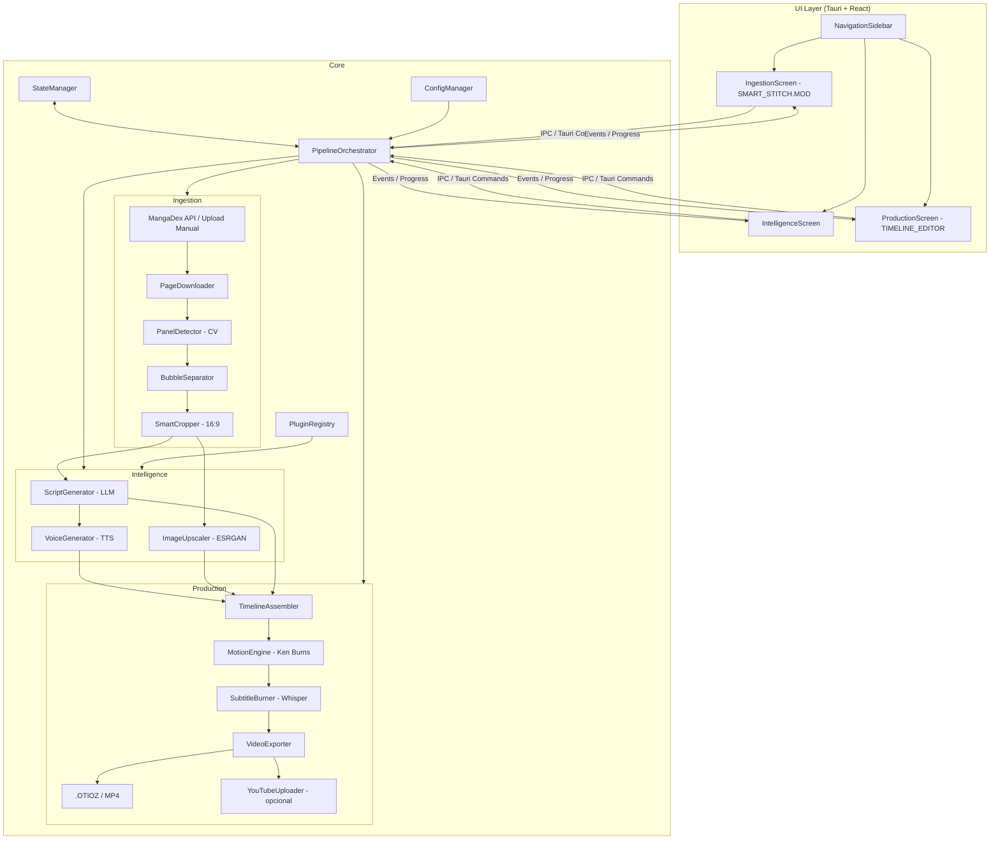
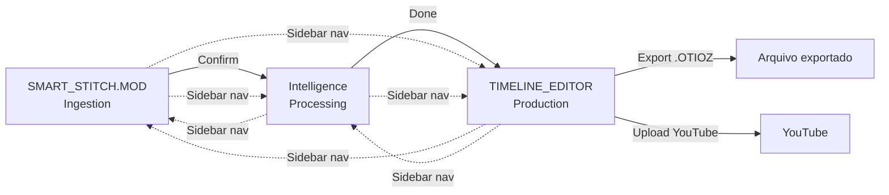
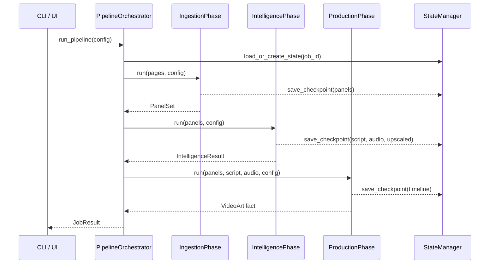
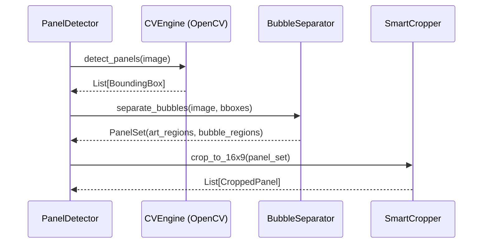

# Design Document: RecapSynth App

## Overview

RecapSynth é uma ferramenta de automação end-to-end para criação de vídeos de recap de anime/manga. O sistema ingere páginas de manga (via MangaDex API ou upload manual), processa painéis com visão computacional, gera roteiro e áudio com LLMs/TTS, aplica upscale nas imagens, monta uma timeline sincronizada com efeitos de movimento e exporta o vídeo final para editores profissionais ou diretamente para o YouTube.

O pipeline é dividido em três fases principais: **Ingestion** (detecção e extração de painéis), **Intelligence** (geração de conteúdo com IA) e **Production** (montagem e exportação do vídeo). Cada fase é independente e pode ser executada separadamente ou encadeada em um pipeline completo.

A arquitetura é modular, orientada a plugins de modelo de IA, permitindo trocar provedores de LLM, TTS e upscale sem alterar o núcleo do sistema. O estado do pipeline é persistido em disco para permitir retomada em caso de falha.

---

## Architecture



---

## UI/UX Design

### Stack de UI

O app desktop é construído com **Tauri + React + TypeScript**. Tauri fornece o shell nativo (Rust) com acesso ao sistema de arquivos e IPC para invocar o pipeline Python via sidecar. React gerencia a UI com estado local e eventos em tempo real via `tauri-plugin-event`.

| Camada | Tecnologia |
|---|---|
| Shell nativo | Tauri 2.x (Rust) |
| UI framework | React 18 + TypeScript |
| Estilização | Tailwind CSS + CSS Variables (dark theme) |
| Componentes | shadcn/ui (base) + componentes customizados |
| Estado global | Zustand |
| IPC com backend | Tauri Commands + Events |
| Backend Python | Sidecar process (PyInstaller bundle) |

---

### Fluxo de Navegação



A navegação principal é linear (Ingestion → Intelligence → Production), mas o usuário pode saltar entre telas via sidebar a qualquer momento. Fases bloqueadas (sem dados) mostram estado desabilitado.

---

### Tela 1: SMART_STITCH.MOD (Ingestion)

Tela de ingestão de páginas de manga e revisão dos painéis detectados.

```
┌─────────────────────────────────────────────────────────────────────┐
│  SMART_STITCH.MOD                                          ⚙ Settings│
├──┬──────────────────────────────────┬────────────────────────────────┤
│  │                                  │  Image Explorer                │
│🔲│   [Manga Page Scroll Viewer]     │  ┌──────┐ ┌──────┐ ┌──────┐  │
│  │                                  │  │ 16:9 │ │ 16:9 │ │ 16:9 │  │
│📋│   ┌──────────────────────────┐   │  └──────┘ └──────┘ └──────┘  │
│  │   │  [Manga page strip 1]    │   │  ┌──────┐ ┌──────┐ ┌──────┐  │
│🎬│   │  (vertical scroll)       │   │  │ 16:9 │ │ 16:9 │ │ 16:9 │  │
│  │   │                          │   │  └──────┘ └──────┘ └──────┘  │
│⚙ │   │  [Manga page strip 2]    │   │                                │
│  │   │                          │   │  [selected panel highlight]    │
│  │   └──────────────────────────┘   │                                │
├──┴──────────────────────────────────┴────────────────────────────────┤
│  FPS: [24 ▼]   Panels: 42 detected    [    Confirm    ]              │
└─────────────────────────────────────────────────────────────────────┘
```

**Componentes:**

- `NavigationSidebar` — sidebar esquerda com ícones para cada fase (Ingestion, Intelligence, Production, Settings). Ícone ativo destacado com accent color.
- `MangaPageViewer` — painel central com scroll vertical exibindo as páginas em tiras longas. Painéis detectados são destacados com overlay colorido ao hover. Suporta zoom e pan.
- `ImageExplorer` — painel direito com grid de thumbnails 16:9 dos painéis recortados. Clique seleciona o painel e sincroniza o destaque no viewer central. Suporta reordenação por drag-and-drop.
- `BottomBar` — barra inferior com seletor de FPS, contador de painéis detectados e botão "Confirm" que dispara a transição para a fase Intelligence.
- `SettingsIcon` — ícone no header que abre modal de configurações globais (providers, API keys, output dir).

**Estados da tela:**
- `idle` — aguardando source (drag-and-drop de imagens ou input de chapter ID)
- `loading` — baixando/processando páginas, progress bar no header
- `review` — painéis detectados, usuário pode excluir/reordenar antes de confirmar
- `confirmed` — transição para Intelligence

---

### Tela 2: Intelligence (Processing)

Tela intermediária de acompanhamento do processamento de IA. Não possui interação pesada — é um painel de progresso com logs em tempo real.

```
┌─────────────────────────────────────────────────────────────────────┐
│  INTELLIGENCE                                              ⚙ Settings│
├──┬──────────────────────────────────────────────────────────────────┤
│  │                                                                   │
│🔲│  Script Generation      ████████████░░░░  68%  [Gemini 1.5 Pro] │
│  │                                                                   │
│📋│  Voice Synthesis        ████░░░░░░░░░░░░  24%  [ElevenLabs]     │
│  │                                                                   │
│🎬│  Image Upscale          ████████████████ 100%  [Real-ESRGAN 4x] │
│  │                                                                   │
│⚙ │  ─────────────────────────────────────────────────────────────  │
│  │  [Live log output...]                                             │
│  │  > Panel 12/42 upscaled (3.2s)                                   │
│  │  > Generating script segment 8/42...                             │
│  │                                                                   │
└──┴──────────────────────────────────────────────────────────────────┘
```

**Componentes:**

- `PhaseProgressList` — lista de tarefas paralelas com barra de progresso individual, nome do provider ativo e status (pending / running / done / error).
- `LiveLogPanel` — terminal-style log com auto-scroll mostrando eventos do pipeline em tempo real via Tauri events.
- Botão "Cancel" disponível durante processamento; botão "Continue to Production" habilitado quando todas as tarefas concluem.

---

### Tela 3: TIMELINE_EDITOR (Production)

Interface estilo editor de vídeo profissional para revisão e exportação do vídeo montado.

```
┌─────────────────────────────────────────────────────────────────────┐
│  TIMELINE_EDITOR                          [EXPORT .OTIOZ]  ⚙        │
├──┬──────────────────┬──────────────────────────────────────────────┤
│  │  Clips / Assets  │                                               │
│🔲│  ┌────────────┐  │         [Video Preview]                      │
│  │  │ clip_001   │  │                                               │
│📋│  │ clip_002   │  │    ┌─────────────────────────────────┐       │
│  │  │ clip_003   │  │    │                                 │       │
│🎬│  │ clip_004   │  │    │   [Anime/Manga frame preview]   │       │
│  │  │ ...        │  │    │                                 │       │
│⚙ │  └────────────┘  │    └─────────────────────────────────┘       │
│  │                  │    ◀◀  ◀  ▶  ▶▶   00:01:55:13                │
├──┴──────────────────┴──────────────────────────────────────────────┤
│  Timeline                                                            │
│  ├─ VIDEO  ████████[clip_001]████[clip_002]████[clip_003]──────── │
│  ├─ AUDIO  ████████[narr_001]████[narr_002]████[narr_003]──────── │
│  └─ SUBS   ─────[sub_001]──────[sub_002]──────[sub_003]────────── │
│                                                                      │
│  ◀◀  ◀  ▶  ▶▶  ⏹   [──────────●──────────────────]  00:01:55:13  │
└─────────────────────────────────────────────────────────────────────┘
```

**Componentes:**

- `AssetPanel` — painel esquerdo com lista de clips gerados. Cada item mostra thumbnail, nome e duração. Clique seleciona o clip e move o playhead na timeline.
- `VideoPreview` — preview central do vídeo com controles de playback (play/pause, step frame, loop). Exibe timecode atual no formato `HH:MM:SS:FF`.
- `Timeline` — trilhas horizontais coloridas:
  - `VideoTrack` (verde) — clips de imagem com Ken Burns aplicado
  - `AudioTrack` (vermelho/laranja) — segmentos de narração TTS
  - `SubtitleTrack` (azul) — blocos de legenda gerados pelo Whisper
  - Suporta scrubbing (arrastar playhead), zoom horizontal e seleção de clip para edição de parâmetros Ken Burns.
- `PlaybackControls` — barra inferior com botões de transporte, slider de posição e timecode.
- `ExportButton` — botão "EXPORT .OTIOZ" no header que abre modal de exportação com opções de formato (MP4, .OTIOZ, ambos) e upload para YouTube.

**Estados da tela:**
- `loading` — montando timeline, spinner no preview
- `ready` — timeline montada, playback disponível
- `exporting` — progress modal com barra de exportação FFmpeg
- `exported` — modal de sucesso com path do arquivo e link YouTube (se aplicável)

---

### Design Tokens (Dark Theme)

```typescript
const tokens = {
  bg: {
    base: "#0d0d0f",       // fundo principal
    surface: "#16161a",    // painéis e cards
    elevated: "#1e1e24",   // modais e dropdowns
  },
  accent: {
    primary: "#7c6af7",    // roxo — ações primárias
    success: "#3ecf8e",    // verde — video track, sucesso
    danger: "#f87171",     // vermelho — audio track, erros
    info: "#60a5fa",       // azul — subtitle track, info
  },
  text: {
    primary: "#e8e8f0",
    secondary: "#8888a0",
    disabled: "#44445a",
  },
  border: "#2a2a38",
}
```

---

## Sequence Diagrams

### Pipeline Completo



### Detecção de Painéis



---

## Components and Interfaces

### PipelineOrchestrator

**Purpose**: Coordena a execução sequencial ou paralela das três fases do pipeline.

**Interface**:
```python
class PipelineOrchestrator:
    def run_pipeline(self, config: PipelineConfig) -> JobResult: ...
    def run_phase(self, phase: PipelinePhase, context: PhaseContext) -> PhaseResult: ...
    def resume_job(self, job_id: str) -> JobResult: ...
    def cancel_job(self, job_id: str) -> None: ...
```

**Responsibilities**:
- Instanciar e encadear as fases do pipeline
- Gerenciar checkpoints via StateManager
- Propagar erros com contexto suficiente para retomada

---

### IngestionPhase

**Purpose**: Baixar páginas, detectar painéis, separar texto de arte e recortar para 16:9.

**Interface**:
```python
class IngestionPhase:
    def run(self, source: PageSource, config: IngestionConfig) -> PanelSet: ...

class PageDownloader:
    def download_chapter(self, chapter_id: str) -> List[PageImage]: ...
    def from_local(self, paths: List[Path]) -> List[PageImage]: ...

class PanelDetector:
    def detect(self, page: PageImage) -> List[Panel]: ...

class BubbleSeparator:
    def separate(self, page: PageImage, panels: List[Panel]) -> List[Panel]: ...

class SmartCropper:
    def crop_to_16x9(self, panel: Panel) -> CroppedPanel: ...
```

**Responsibilities**:
- Suportar fonte MangaDex e upload local
- Detectar painéis com OpenCV (contornos + heurísticas)
- Isolar regiões de balões de fala
- Produzir crops com aspect ratio 16:9 sem distorção

---

### IntelligencePhase

**Purpose**: Gerar roteiro com LLM, sintetizar voz e fazer upscale das imagens.

**Interface**:
```python
class IntelligencePhase:
    def run(self, panels: PanelSet, config: IntelligenceConfig) -> IntelligenceResult: ...

class ScriptGenerator:
    def generate(self, panels: PanelSet, prompt: str, model: LLMProvider) -> Script: ...

class VoiceGenerator:
    def synthesize(self, script: Script, provider: TTSProvider) -> List[AudioSegment]: ...

class ImageUpscaler:
    def upscale(self, panel: CroppedPanel, model: UpscaleModel) -> UpscaledImage: ...

class LLMProvider(Protocol):
    def complete(self, messages: List[Message], config: LLMConfig) -> str: ...

class TTSProvider(Protocol):
    def synthesize(self, text: str, voice_id: str) -> bytes: ...
```

**Responsibilities**:
- Abstrair provedores de LLM via Protocol (Gemini, Mistral, Ollama, Groq, OpenRouter)
- Abstrair provedores de TTS via Protocol (ElevenLabs, OpenAI TTS, local)
- Executar upscale com Real-ESRGAN ou Waifu2x
- Processar em batch com controle de rate limit

---

### ProductionPhase

**Purpose**: Montar timeline, aplicar efeitos de movimento, gravar legendas e exportar.

**Interface**:
```python
class ProductionPhase:
    def run(self, assets: ProductionAssets, config: ProductionConfig) -> VideoArtifact: ...

class TimelineAssembler:
    def assemble(self, panels: List[UpscaledImage], audio: List[AudioSegment], script: Script) -> Timeline: ...

class MotionEngine:
    def apply_ken_burns(self, clip: ImageClip, params: KenBurnsParams) -> VideoClip: ...

class SubtitleBurner:
    def transcribe_and_burn(self, video: VideoClip, audio: List[AudioSegment]) -> VideoClip: ...

class VideoExporter:
    def export_mp4(self, timeline: Timeline, output: Path, config: ExportConfig) -> Path: ...
    def export_otioz(self, timeline: Timeline, output: Path) -> Path: ...

class YouTubeUploader:
    def upload(self, video: Path, metadata: VideoMetadata, credentials: OAuthCredentials) -> str: ...
```

**Responsibilities**:
- Sincronizar imagens com segmentos de áudio
- Aplicar Ken Burns effect com keyframes automáticos
- Usar Whisper para transcrição e geração de legendas SRT
- Exportar para MP4 (FFmpeg) e .OTIOZ (DaVinci/Premiere)
- Upload opcional para YouTube via Data API v3

---

### StateManager

**Purpose**: Persistir e recuperar o estado do pipeline para suporte a checkpoints.

**Interface**:
```python
class StateManager:
    def save_checkpoint(self, job_id: str, phase: str, data: Any) -> None: ...
    def load_checkpoint(self, job_id: str, phase: str) -> Optional[Any]: ...
    def get_job_status(self, job_id: str) -> JobStatus: ...
    def list_jobs(self) -> List[JobSummary]: ...
```

---

### PluginRegistry

**Purpose**: Registrar e resolver implementações de provedores de IA em runtime.

**Interface**:
```python
class PluginRegistry:
    def register_llm(self, name: str, provider: Type[LLMProvider]) -> None: ...
    def register_tts(self, name: str, provider: Type[TTSProvider]) -> None: ...
    def resolve_llm(self, name: str) -> LLMProvider: ...
    def resolve_tts(self, name: str) -> TTSProvider: ...
```

---

## Data Models

### PipelineConfig

```python
@dataclass
class PipelineConfig:
    job_id: str                          # UUID gerado automaticamente
    source: PageSource                   # MangaDex chapter_id ou paths locais
    llm_provider: str                    # "gemini" | "mistral" | "ollama" | "groq" | "openrouter"
    llm_model: str                       # ex: "gemini-1.5-pro"
    tts_provider: str                    # "elevenlabs" | "openai" | "local"
    tts_voice_id: str
    upscale_model: str                   # "realesrgan" | "waifu2x"
    upscale_factor: int                  # 2 | 4
    export_format: str                   # "mp4" | "otioz" | "both"
    upload_youtube: bool
    output_dir: Path
    language: str                        # "pt-BR" | "en-US" | ...
```

### Panel

```python
@dataclass
class Panel:
    page_index: int
    panel_index: int
    bbox: BoundingBox                    # (x, y, width, height)
    art_region: np.ndarray               # imagem sem balões
    bubble_regions: List[BubbleRegion]   # regiões de texto isoladas
    raw_image: np.ndarray
```

### BoundingBox

```python
@dataclass
class BoundingBox:
    x: int
    y: int
    width: int
    height: int

    @property
    def aspect_ratio(self) -> float: ...
    def to_16x9(self, canvas_width: int) -> "BoundingBox": ...
```

### Script

```python
@dataclass
class Script:
    segments: List[ScriptSegment]
    total_duration_estimate: float       # segundos

@dataclass
class ScriptSegment:
    panel_index: int
    narration: str
    duration_hint: float                 # segundos estimados
    emotion: str                         # "neutral" | "excited" | "dramatic"
```

### Timeline

```python
@dataclass
class Timeline:
    clips: List[TimelineClip]
    total_duration: float
    fps: int
    resolution: Tuple[int, int]          # (1920, 1080)

@dataclass
class TimelineClip:
    panel: UpscaledImage
    audio: AudioSegment
    start_time: float
    end_time: float
    ken_burns: KenBurnsParams

@dataclass
class KenBurnsParams:
    start_zoom: float                    # ex: 1.0
    end_zoom: float                      # ex: 1.15
    start_pan: Tuple[float, float]       # (x%, y%) normalizado 0-1
    end_pan: Tuple[float, float]
    easing: str                          # "linear" | "ease_in_out"
```

### JobResult

```python
@dataclass
class JobResult:
    job_id: str
    status: JobStatus                    # SUCCESS | FAILED | PARTIAL
    output_files: List[Path]
    youtube_url: Optional[str]
    duration_seconds: float
    error: Optional[str]
```

---

## Algorithmic Pseudocode

### Pipeline Principal

```python
def run_pipeline(config: PipelineConfig) -> JobResult:
    """
    Preconditions:
      - config.job_id is a valid UUID
      - config.source points to accessible pages
      - at least one LLM provider is configured

    Postconditions:
      - Returns JobResult with status SUCCESS or FAILED
      - All intermediate artifacts are persisted in config.output_dir
      - State checkpoint exists for each completed phase
    """
    state = StateManager(config.output_dir)
    
    # Phase 1: Ingestion
    if not state.load_checkpoint(config.job_id, "ingestion"):
        pages = PageDownloader().fetch(config.source)
        panels = []
        for page in pages:
            detected = PanelDetector().detect(page)
            separated = BubbleSeparator().separate(page, detected)
            cropped = [SmartCropper().crop_to_16x9(p) for p in separated]
            panels.extend(cropped)
        state.save_checkpoint(config.job_id, "ingestion", panels)
    else:
        panels = state.load_checkpoint(config.job_id, "ingestion")
    
    # Phase 2: Intelligence
    if not state.load_checkpoint(config.job_id, "intelligence"):
        llm = PluginRegistry().resolve_llm(config.llm_provider)
        script = ScriptGenerator().generate(panels, llm)
        audio_segments = VoiceGenerator().synthesize(script, config.tts_provider)
        upscaled = [ImageUpscaler().upscale(p, config.upscale_model) for p in panels]
        result = IntelligenceResult(script, audio_segments, upscaled)
        state.save_checkpoint(config.job_id, "intelligence", result)
    else:
        result = state.load_checkpoint(config.job_id, "intelligence")
    
    # Phase 3: Production
    timeline = TimelineAssembler().assemble(result.upscaled, result.audio, result.script)
    video = MotionEngine().apply_ken_burns_to_timeline(timeline)
    video = SubtitleBurner().transcribe_and_burn(video, result.audio)
    output = VideoExporter().export(video, config)
    
    if config.upload_youtube:
        url = YouTubeUploader().upload(output, config)
        return JobResult(job_id=config.job_id, status=JobStatus.SUCCESS,
                         output_files=[output], youtube_url=url)
    
    return JobResult(job_id=config.job_id, status=JobStatus.SUCCESS, output_files=[output])
```

### Detecção de Painéis (OpenCV)

```python
def detect_panels(image: np.ndarray) -> List[BoundingBox]:
    """
    Preconditions:
      - image is a valid numpy array with shape (H, W, 3) or (H, W)
      - image.dtype == uint8

    Postconditions:
      - Returns list of non-overlapping BoundingBoxes
      - Each bbox has area > MIN_PANEL_AREA
      - Bboxes are sorted top-to-bottom, left-to-right

    Loop Invariant:
      - All bboxes in result so far are non-overlapping and above MIN_PANEL_AREA
    """
    gray = cv2.cvtColor(image, cv2.COLOR_BGR2GRAY)
    _, binary = cv2.threshold(gray, 240, 255, cv2.THRESH_BINARY_INV)
    
    # Morfologia para fechar gaps entre painéis
    kernel = cv2.getStructuringElement(cv2.MORPH_RECT, (3, 3))
    closed = cv2.morphologyEx(binary, cv2.MORPH_CLOSE, kernel)
    
    contours, _ = cv2.findContours(closed, cv2.RETR_EXTERNAL, cv2.CHAIN_APPROX_SIMPLE)
    
    bboxes = []
    for contour in contours:
        x, y, w, h = cv2.boundingRect(contour)
        area = w * h
        # Loop invariant: bboxes contém apenas painéis válidos até este ponto
        if area > MIN_PANEL_AREA and w / h < MAX_ASPECT_RATIO:
            bboxes.append(BoundingBox(x, y, w, h))
    
    return sorted(bboxes, key=lambda b: (b.y, b.x))
```

### Crop Inteligente 16:9

```python
def crop_to_16x9(panel: Panel, target_width: int = 1920) -> CroppedPanel:
    """
    Preconditions:
      - panel.art_region is a valid numpy array
      - target_width > 0

    Postconditions:
      - result.image has aspect ratio 16:9 (±1px tolerance)
      - result.image.shape[1] == target_width
      - No distortion: original content is cropped, not stretched

    Loop Invariants: N/A
    """
    target_height = int(target_width * 9 / 16)
    h, w = panel.art_region.shape[:2]
    
    # Calcular escala para cobrir o canvas 16:9
    scale = max(target_width / w, target_height / h)
    new_w = int(w * scale)
    new_h = int(h * scale)
    
    resized = cv2.resize(panel.art_region, (new_w, new_h), interpolation=cv2.INTER_LANCZOS4)
    
    # Centralizar o crop
    x_offset = (new_w - target_width) // 2
    y_offset = (new_h - target_height) // 2
    
    cropped = resized[y_offset:y_offset + target_height, x_offset:x_offset + target_width]
    
    return CroppedPanel(image=cropped, source_panel=panel, scale_factor=scale)
```

### Geração de Roteiro com LLM

```python
def generate_script(panels: List[CroppedPanel], llm: LLMProvider, config: ScriptConfig) -> Script:
    """
    Preconditions:
      - len(panels) > 0
      - llm is a valid, authenticated LLMProvider
      - config.language is a valid BCP-47 language tag

    Postconditions:
      - result.segments has len == len(panels)
      - Each segment.narration is non-empty
      - sum(s.duration_hint for s in result.segments) > 0

    Loop Invariant:
      - All segments generated so far have non-empty narration
    """
    segments = []
    
    # Batch panels para reduzir chamadas à API
    for batch in chunked(panels, config.batch_size):
        images_b64 = [encode_image_b64(p.image) for p in batch]
        
        prompt = build_script_prompt(
            images=images_b64,
            language=config.language,
            style=config.narration_style,
            context=segments[-3:] if segments else []  # contexto dos últimos 3 segmentos
        )
        
        response = llm.complete(
            messages=[{"role": "user", "content": prompt}],
            config=LLMConfig(max_tokens=2048, temperature=0.7)
        )
        
        batch_segments = parse_script_response(response, batch)
        # Loop invariant: todos os segmentos em batch_segments têm narração não-vazia
        segments.extend(batch_segments)
    
    return Script(segments=segments, total_duration_estimate=sum(s.duration_hint for s in segments))
```

### Ken Burns Effect

```python
def apply_ken_burns(clip: ImageClip, params: KenBurnsParams, fps: int = 30) -> VideoClip:
    """
    Preconditions:
      - clip.duration > 0
      - 1.0 <= params.start_zoom <= params.end_zoom <= 2.0
      - All pan values are in [0.0, 1.0]

    Postconditions:
      - result.duration == clip.duration
      - result.size == clip.size
      - Zoom interpolates smoothly from start_zoom to end_zoom

    Loop Invariant:
      - At each frame t, zoom(t) is between start_zoom and end_zoom
    """
    def make_frame(t: float) -> np.ndarray:
        progress = t / clip.duration  # [0.0, 1.0]
        
        if params.easing == "ease_in_out":
            progress = ease_in_out_cubic(progress)
        
        zoom = lerp(params.start_zoom, params.end_zoom, progress)
        pan_x = lerp(params.start_pan[0], params.end_pan[0], progress)
        pan_y = lerp(params.start_pan[1], params.end_pan[1], progress)
        
        frame = clip.get_frame(t)
        h, w = frame.shape[:2]
        
        # Calcular região de crop baseada no zoom e pan
        crop_w = int(w / zoom)
        crop_h = int(h / zoom)
        x = int((w - crop_w) * pan_x)
        y = int((h - crop_h) * pan_y)
        
        cropped = frame[y:y + crop_h, x:x + crop_w]
        # Loop invariant: zoom está entre start_zoom e end_zoom
        return cv2.resize(cropped, (w, h), interpolation=cv2.INTER_LINEAR)
    
    return VideoClip(make_frame, duration=clip.duration).set_fps(fps)
```

---

## Key Functions with Formal Specifications

### `separate_bubbles(image, panels) -> List[Panel]`

```python
def separate_bubbles(image: np.ndarray, panels: List[Panel]) -> List[Panel]:
    ...
```

**Preconditions:**
- `image` é um array numpy válido com dtype uint8
- `panels` é uma lista não-vazia de painéis detectados na mesma imagem

**Postconditions:**
- Cada painel retornado tem `art_region` sem pixels de balões de fala
- `bubble_regions` contém todas as regiões de texto isoladas
- A união de `art_region` e `bubble_regions` cobre o bbox original do painel

---

### `synthesize(script, provider) -> List[AudioSegment]`

```python
def synthesize(script: Script, provider: TTSProvider) -> List[AudioSegment]:
    ...
```

**Preconditions:**
- `script.segments` é não-vazio
- `provider` está autenticado e disponível
- Cada `segment.narration` é uma string não-vazia

**Postconditions:**
- `len(result) == len(script.segments)`
- Cada `AudioSegment.duration` corresponde ao `duration_hint` do segmento (±20%)
- Todos os arquivos de áudio estão em formato WAV 44.1kHz

---

### `assemble(panels, audio, script) -> Timeline`

```python
def assemble(panels: List[UpscaledImage], audio: List[AudioSegment], script: Script) -> Timeline:
    ...
```

**Preconditions:**
- `len(panels) == len(audio) == len(script.segments)`
- Todos os painéis têm resolução ≥ 1920×1080
- Todos os segmentos de áudio são válidos

**Postconditions:**
- `timeline.clips` tem exatamente `len(panels)` clipes
- Cada clipe tem `start_time` e `end_time` não sobrepostos
- `timeline.total_duration == sum(a.duration for a in audio)`

---

## Error Handling

### Falha na API do MangaDex

**Condition**: Rate limit (429) ou capítulo não disponível (404)
**Response**: Retry com exponential backoff (máx 3 tentativas), fallback para upload manual
**Recovery**: Salvar checkpoint parcial; retomar do último capítulo bem-sucedido

### Falha no Provedor de LLM

**Condition**: Timeout, quota excedida ou resposta malformada
**Response**: Tentar provedor alternativo se configurado; logar erro com contexto do batch
**Recovery**: Retomar geração de script a partir do último batch bem-sucedido via checkpoint

### Falha no Upscale

**Condition**: OOM (Out of Memory) ao processar imagem grande
**Response**: Reduzir batch size automaticamente; tentar com fator de upscale menor
**Recovery**: Usar imagem original sem upscale como fallback, registrar aviso

### Falha na Exportação de Vídeo

**Condition**: FFmpeg retorna código de erro não-zero
**Response**: Capturar stderr do FFmpeg, logar comando completo para diagnóstico
**Recovery**: Tentar com preset de qualidade menor; manter timeline montada para re-exportação

---

## Testing Strategy

### Unit Testing Approach

Cada componente é testado isoladamente com mocks para dependências externas (APIs, modelos de IA). Foco em:
- `PanelDetector`: testar com imagens sintéticas de manga com painéis conhecidos
- `SmartCropper`: verificar aspect ratio e ausência de distorção
- `TimelineAssembler`: verificar sincronização de áudio e ausência de sobreposição de clipes
- `KenBurnsParams`: verificar interpolação de zoom e pan em todos os frames

### Property-Based Testing Approach

**Property Test Library**: `hypothesis`

Propriedades a verificar:
- Para qualquer imagem válida, `detect_panels` retorna bboxes não-sobrepostos
- Para qualquer painel, `crop_to_16x9` retorna imagem com aspect ratio 16:9 (±1px)
- Para qualquer script válido, `assemble` produz timeline sem gaps ou sobreposições
- Para qualquer `KenBurnsParams` válido, todos os frames têm zoom dentro do intervalo `[start_zoom, end_zoom]`

### Integration Testing Approach

- Pipeline end-to-end com capítulo de manga de domínio público (ex: capítulo 1 de One Piece)
- Testar cada combinação de provedor LLM + TTS com mocks de resposta gravados
- Testar exportação MP4 e verificar duração e resolução do arquivo de saída com `ffprobe`

---

## Performance Considerations

- **Upscale em batch**: processar múltiplos painéis em paralelo com `concurrent.futures.ThreadPoolExecutor`; limitar workers baseado em VRAM disponível
- **LLM batching**: agrupar painéis em batches de 4-8 para reduzir latência de API
- **Checkpoint granular**: salvar estado após cada painel processado para evitar reprocessamento em falhas
- **Lazy loading**: carregar imagens em memória apenas quando necessário; liberar após upscale
- **FFmpeg pipeline**: usar pipes em vez de arquivos temporários intermediários para montagem de vídeo

---

## Security Considerations

- **API Keys**: armazenar credenciais em variáveis de ambiente ou arquivo `.env`; nunca serializar em checkpoints
- **YouTube OAuth**: usar fluxo PKCE; armazenar tokens com permissões restritas de arquivo (600)
- **Validação de input**: validar paths de upload local para prevenir path traversal
- **Rate limiting**: respeitar limites de API de todos os provedores; implementar backoff para evitar banimento
- **Conteúdo**: não armazenar conteúdo de manga em servidores; processar localmente e deletar temporários após exportação

---

## Dependencies

| Dependência | Versão | Uso |
|---|---|---|
| `tauri` | ≥2.0 | Shell nativo desktop (Rust) |
| `react` | ≥18.0 | UI framework |
| `zustand` | ≥4.0 | Estado global da UI |
| `tailwindcss` | ≥3.4 | Estilização utilitária |
| `opencv-python` | ≥4.8 | Detecção de painéis, processamento de imagem |
| `numpy` | ≥1.24 | Manipulação de arrays de imagem |
| `moviepy` | ≥1.0 | Montagem de timeline e efeitos de vídeo |
| `ffmpeg-python` | ≥0.2 | Exportação de vídeo via FFmpeg |
| `openai-whisper` | ≥20231117 | Transcrição para legendas |
| `realesrgan` | ≥0.3 | Upscale de imagens |
| `httpx` | ≥0.25 | Chamadas HTTP para APIs (MangaDex, LLMs) |
| `pydantic` | ≥2.0 | Validação de modelos de dados |
| `hypothesis` | ≥6.0 | Property-based testing |
| `google-generativeai` | ≥0.3 | Provedor Gemini |
| `google-api-python-client` | ≥2.0 | YouTube Data API v3 |
| `python-dotenv` | ≥1.0 | Gerenciamento de variáveis de ambiente |

---

## Correctness Properties

*A property is a characteristic or behavior that should hold true across all valid executions of a system — essentially, a formal statement about what the system should do. Properties serve as the bridge between human-readable specifications and machine-verifiable correctness guarantees.*

### Property 1: Checkpoint round-trip

*For any* job_id, phase name, and serializable data object, saving a checkpoint and then loading it should produce an object equivalent to the original.

**Validates: Requirements 2.1, 2.2**

---

### Property 2: Retomada sem reprocessamento

*For any* pipeline job onde a fase Ingestion foi concluída com checkpoint salvo, retomar o job deve pular a fase Ingestion e executar apenas as fases restantes.

**Validates: Requirements 1.5, 2.2**

---

### Property 3: Checkpoints não contêm credenciais

*For any* checkpoint salvo pelo StateManager, o conteúdo serializado não deve conter strings que correspondam ao padrão de API keys ou tokens OAuth presentes na PipelineConfig.

**Validates: Requirements 2.5, 14.1**

---

### Property 4: Upload local preserva quantidade de páginas

*For any* lista não-vazia de paths de arquivos de imagem válidos, o PageDownloader deve retornar uma lista de PageImages com exatamente o mesmo número de elementos.

**Validates: Requirements 3.3**

---

### Property 5: Painéis detectados são não-sobrepostos

*For any* PageImage válida, os BoundingBoxes retornados pelo PanelDetector não devem ter sobreposição entre si (interseção de área zero).

**Validates: Requirements 4.1**

---

### Property 6: Painéis detectados estão em ordem de leitura

*For any* PageImage válida com múltiplos painéis, os BoundingBoxes retornados pelo PanelDetector devem estar ordenados por (y, x) — de cima para baixo, esquerda para direita.

**Validates: Requirements 4.2**

---

### Property 7: BubbleSeparator preserva cobertura do bbox

*For any* Panel detectado, a união de art_region e bubble_regions deve cobrir toda a área do bbox original do painel.

**Validates: Requirements 4.3**

---

### Property 8: SmartCropper produz aspect ratio 16:9

*For any* Panel válido, o CroppedPanel retornado pelo SmartCropper deve ter aspect ratio 16:9 com tolerância de ±1 pixel, sem distorção do conteúdo.

**Validates: Requirements 4.4, 4.5**

---

### Property 9: Script tem um segmento por painel

*For any* PanelSet não-vazio, o Script retornado pelo ScriptGenerator deve ter exatamente len(panels) ScriptSegments, todos com narration não-vazia.

**Validates: Requirements 5.1, 5.2**

---

### Property 10: Áudio tem um segmento por ScriptSegment

*For any* Script válido, a lista de AudioSegments retornada pelo VoiceGenerator deve ter exatamente len(script.segments) elementos, todos em formato WAV 44.1kHz.

**Validates: Requirements 6.1, 6.3**

---

### Property 11: Duração do áudio respeita duration_hint

*For any* ScriptSegment com duration_hint > 0, a duração do AudioSegment sintetizado deve estar dentro do intervalo [duration_hint × 0.8, duration_hint × 1.2].

**Validates: Requirements 6.2**

---

### Property 12: UpscaledImage tem resolução mínima

*For any* CroppedPanel válido, a UpscaledImage retornada pelo ImageUpscaler deve ter largura ≥ 1920 e altura ≥ 1080 pixels.

**Validates: Requirements 7.1**

---

### Property 13: Timeline tem um clipe por painel

*For any* conjunto de UpscaledImages, AudioSegments e Script com o mesmo número de elementos, a Timeline retornada pelo TimelineAssembler deve ter exatamente len(panels) TimelineClips.

**Validates: Requirements 8.1**

---

### Property 14: Clipes da timeline não se sobrepõem

*For any* Timeline montada, nenhum par de TimelineClips deve ter sobreposição temporal (o end_time de um clipe deve ser ≤ ao start_time do próximo).

**Validates: Requirements 8.2**

---

### Property 15: Duração total da timeline é consistente

*For any* Timeline montada, total_duration deve ser igual à soma das durações de todos os AudioSegments utilizados na montagem.

**Validates: Requirements 8.3**

---

### Property 16: Ken Burns zoom permanece no intervalo configurado

*For any* KenBurnsParams válido com 1.0 ≤ start_zoom ≤ end_zoom ≤ 2.0, o valor de zoom calculado para cada frame deve estar dentro do intervalo [start_zoom, end_zoom].

**Validates: Requirements 8.4, 8.5**

---

### Property 17: Path traversal é rejeitado

*For any* string de path que contenha a sequência `../` ou `..\`, o PageDownloader deve rejeitar o input e retornar erro de validação sem realizar nenhum acesso ao sistema de arquivos.

**Validates: Requirements 3.4, 14.3**
